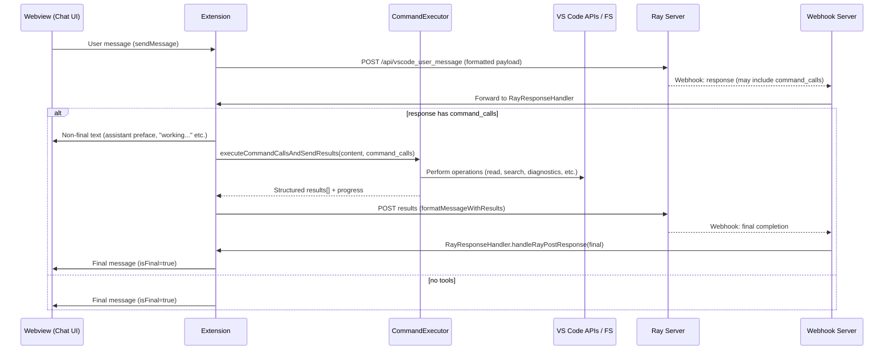

# RayDaemon – Command Flow & Tool Execution (Developer Guide)

> **Scope:** This document explains how RayDaemon parses, routes, executes, and reports **commands** (“tools”) end‑to‑end. It covers user intent → parser → handler selection → method execution → UI feedback → sending results back to Ray → receiving Ray’s follow‑up.  
> **Audience:** Contributors touching `src/commands`, `src/extension_utils`, and the webview UI.

---

## Mental Model

- **Ray** (server) may ask the extension to run **one or more commands** (aka *command_calls*) in response to a user message.
- The extension executes them **locally** (VS Code APIs + Node), then posts **structured results** back to Ray.
- Ray synthesizes a final answer using those results and calls back to our **webhook** with the completion for display.

At any time, Ray might respond **with** or **without** command calls:
- **With tools** → run tools → send results → Ray replies again with the “final” → UI render.
- **Without tools** → render final immediately.

---

## High‑Level Sequence



---

## Key Components (source layout)

- **Command registration & routing**
  - `src/commands/commandHandler.ts` – registers the top-level `raydaemon.executeCommand` entry and CLI-like commands (e.g., `/help`, `/status`, `/test`).
  - `src/commands/index.ts` – command palette entries (open panel, side view), and webview content bootstrap.
  - `src/commands/handlers/*` – domain routers (diagnostics, filesystem, search, navigation, index, general…).
  - `src/commands/commandMethods/*` – leaf operations (e.g., `fs/read`, `fs/append`, diagnostics fetch/format, etc.).

- **Execution engine**
  - `src/extension_utils/commandExecutor.ts` – orchestrates a **batch** of `command_calls`, generates user-facing tool labels, aggregates structured outputs, and returns a normalized result array.

- **Ray loop & transport**
  - `src/rayLoop.ts` – `sendToRayLoop()`, `sendCommandResultsToRay()`, active tool guard.
  - `src/extension_utils/webhookServer.ts` – receives Ray webhooks.
  - `src/extension_utils/rayResponseHandler.ts` – parses Ray webhook payloads and posts to the webview.
  - `src/config.ts` – endpoints, headers, and payload shaping (`formatMessage`, `formatMessageWithResults`).

- **UI**
  - `src/ui/WebviewContent.ts` (+ `webViewContentUtils`) – injects CSS/JS and exposes `acquireVsCodeApi()`.
  - `src/ui/RayDaemonViewProvider.ts` – webview host; IPC wiring (`showTypingIndicator`, `rayResponse`, errors).

> Paths are the canonical `src/` locations (not `out/` builds).

---

## Command Call Shape (from Ray API )

Each tool request from Ray arrives as a **command call** object. The minimal shape we expect:

```ts
type CommandCall = {
  command: string;          // e.g., "read", "searchText", "getDiagnostics"
  args?: (string|number)[]; // positional args
  opts?: Record<string, any>; // optional named options
  id?: string;              // optional correlation id (echo back if provided)
};
```

Ray’s webhook payload includes:
```ts
type RayWebhook = {
  content?: string;                   // assistant text (preface/streamed chunk)
  command_calls?: CommandCall[];      // zero or more tools to run
  // ...other Ray metadata
};
```

---

## Parsing & Dispatch

1. **RayResponseHandler** inspects the webhook:
   - De‑dupes by hashing the full payload (to ignore webhook retries).
   - Extracts a human‑readable `content` (may be empty if Ray only asked for tools).
   - If `command_calls?.length`, it sends a **non‑final** update to UI and forwards to **CommandExecutor**.

2. **CommandExecutor.executeCommandCallsAndSendResults(content, command_calls)**:
   - Creates a progress model (per‑tool label via `generateToolNames()`).
   - Iterates calls and dispatches to the correct **handler**.
   - Collects **structured results** with a normalized envelope:
     ```ts
     type ToolResult = {
       command: string;
       status: "ok" | "error";
       output: any;           // structured, JSON-serializable
       elapsed_ms?: number;
       label?: string;        // user-facing description
       id?: string;           // echo correlation id from request (if present)
     };
     ```
   - Returns `ToolResult[]` and streams user-visible progress to UI as available (optional).

3. **Handler selection** follows a simple map:
   - Diagnostics: `src/commands/handlers/diagnosticHandlers.ts`
   - FS ops: `src/commands/handlers/fileSystemHandlers.ts` -> `commandMethods/fs/*`
   - Search/Symbols/Navigation: `src/commands/handlers/{searchHandlers,symbolHandlers,navigationHandlers}.ts`
   - General: `src/commands/handlers/generalHandlers.ts` (e.g., `/status`, `/test`), or loop helpers.

4. **Leaf methods** perform actual work via VS Code APIs / Node FS and return plain JSON objects only (no functions, no class instances).

---

## Typical Commands (Examples)

### Filesystem
- `read(path) → { path, content, size, mtime }`
- `append(path, text) → { path, bytesAppended }`
- `createIndex(root?) → { filesIndexed, symbolsExtracted }`
- `searchText(root, query, { caseSensitive, maxResults }) → { matches: Array<{file, line, preview}> }`

### Diagnostics
- `getDiagnostics() → { files: Array<{uri, problems: Array<{severity, message, range}>}> }`
- `formatDiagnostics(...) → { markdown }`
- `diagnosticWatcher(start|stop) → { watching: boolean }`

### Code Intel / Navigation
- `findSymbols(query) → { symbols: Array<{name, kind, file, line, character}> }`
- `openFile(path, { preview }) → { opened: true }`

> The exact set evolves; use the handler map as the source of truth.

---

## Progress & UI Feedback

- When tools are present:
  - Webview gets a **non‑final** `rayResponse` with `isFinal=false` (assistant text so far).
  - (Optional) Tool progress pings can be posted as discrete messages to the webview (e.g., “Searching…”, “Modified 1 file…”).
- On error in any tool:
  - The executor still returns a `ToolResult` with `status:"error"` and the stringified error in `output`.
  - After the batch, the extension **always** POSTs back to Ray (success or error) with **all** results.

---

## Posting Results Back to Ray

- `sendCommandResultsToRay(content, results)` builds a body via `config.formatMessageWithResults(content, results)` and POSTs to `config.apiEndpoint`.
- Ray then calls our webhook again with the **final** message; `RayResponseHandler` will deliver it to the UI with `isFinal=true`.

**Idempotency:** a `Set` in `RayResponseHandler` avoids processing the **same** webhook body twice (server retries).

**Active tool guard:** `src/rayLoop.ts` tracks “active tool execution” to avoid overlapping result posts for the same batch if your UI or Ray retries mid‑flight.

---

## Error Handling & Timeouts

- Network:
  - `ApiClient` sets request headers and timeouts (30s by default). Errors are logged with details.
- Tool errors:
  - Caught and wrapped into `ToolResult{status:"error"}`. The batch continues unless a **fatal** invariant is broken.
- Webhook port conflicts:
  - `WebhookServer` detects `EADDRINUSE` and shows an actionable error (“free port X”).

---

## Payload Contracts

### To Ray (initial)
```jsonc
{
  "message": "User prompt here",
  "model": null,
  "thinking_budget": 0,
  "include_system": true,
  "use_memory": true,
  "max_memory_messages": 10
}
```

### To Ray (with results)
```jsonc
{
  "message": "Assistant content that triggered tools",
  "command_results": [
    {
      "command": "searchText",
      "status": "ok",
      "output": { "matches": [/*...*/] },
      "elapsed_ms": 42,
      "label": "Searching \"foo\"",
      "id": "abc123"
    }
  ],
  "model": null,
  "thinking_budget": 0,
  "include_system": true,
  "use_memory": true,
  "max_memory_messages": 10
}
```

### To Webview (from extension)
```jsonc
{ "type": "rayResponse", "data": { "content": "...", "isFinal": false, "isWorking": false } }
{ "type": "rayResponse", "data": { "content": "...", "isFinal": true,  "isWorking": false } }
{ "type": "showTypingIndicator" } / { "type": "hideTypingIndicator" }
```

---

## Concurrency & Ordering

- Commands in a batch execute **sequentially** unless the handler explicitly parallelizes safe steps.
- Results preserve the **original order** of `command_calls` for deterministic Ray reasoning.
- A second webhook may arrive while tools from the first are still running; the **active tool guard** prevents double‑posting results. (Design note: correlation IDs are recommended; see Enhancements below.)

---

## Security & Safety

- **Serialization only**: results must be JSON‑serializable (no functions, BigInt, or class instances).
- **Path hygiene**: FS handlers normalize user‑provided paths and restrict operations to the workspace (configurable).
- **Large payloads**: avoid sending enormous buffers back to Ray; summarize and attach path references, sizes, and previews.

---

## Edge Cases & Gotchas

1. **Duplicate webhook body** (server retries) → skipped by de‑dupe set.
2. **Empty `content` but tool calls exist** → UI only shows progress and then final response from Ray.
3. **Very large results** → can choke Ray or webview; truncate or stream progressive summaries.
4. **Panel reference lost** → ensure `global.currentPanel` (or the WebviewView shim) is set before posting.
5. **Circular JSON** → sanitize outputs before including in `command_results`.

---

## Enhancements (Recommended)

- **Correlation IDs**: enforce `id` for each `command_call` and echo it in `ToolResult.id` for precise tracing.
- **Per‑tool timeouts**: configurable ceilings with cancellation support via VS Code `CancellationToken`.
- **Partial streaming**: post interim mini‑results to the webview for long operations (e.g., searching large trees).
- **Rich diff UX**: standardize result schemas for file changes so the webview can render inline diffs consistently.
- **Telemetry**: optional anonymized metrics (tool frequency, durations, error codes) gated behind a setting.

---

## Test Probes (Copy‑Paste)

**Simulate a Ray response with tools (Dev only):**
```ts
// In a dev command or REPL inside the extension host:
rayResponseHandler.handleRayPostResponse({
  content: "I'll check that for you…",
  command_calls: [
    { command: "searchText", args: ["./", "TODO", { maxResults: 5 }] },
    { command: "read", args: ["README.md"] }
  ]
});
```

**Force a tool error path:**
```ts
rayResponseHandler.handleRayPostResponse({
  content: "Trying a risky operation…",
  command_calls: [{ command: "read", args: ["<nonexistent>"] }]
});
```

---

## FAQ

- **Q:** Why do I see logs that results were sent, but the UI shows nothing?  
  **A:** The UI only shows **webhook** completions. If you sent results to Ray but didn’t receive the follow‑up webhook (yet), the final message isn’t posted. Check webhook server logs and `RayResponseHandler` de‑dupe status.

- **Q:** Can I run tools without waiting for Ray?  
  **A:** Yes—local commands via the command palette or CLI mode (`/status`, `/help`, etc.) return directly to the webview without Ray.

- **Q:** Where do I change the endpoint/port?  
  **A:** `src/config.ts` → `apiEndpoint` and `webhookPort`.

---

*This document reflects the canonical `src/` structure. If a handler or method is missing in your workspace, check the latest commits or open an issue to update the map.*
